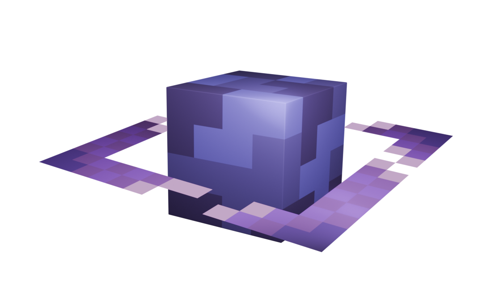

import { FileTree } from '@astrojs/starlight/components';
import { LinkButton } from '@astrojs/starlight/components';
import { Tabs, TabItem } from '@astrojs/starlight/components';
import { Steps } from '@astrojs/starlight/components';
import { Badge } from '@astrojs/starlight/components';
import { LinkCard } from '@astrojs/starlight/components';
import { Aside } from '@astrojs/starlight/components';

<center>
<div style={{ "width": "70%", "margin": "8px" }}>
    
</div>
</center>

---
<Aside type="tip" title="О-нас">
    Хай!
    <br>Добро пожаловать на XL-servers - ванильный и лучший из ста!</br>
    <br>Наш сервер - это бесплатный сервер, базирующийся на ванильности и дружелюбности как комьюнити, так и отзывчивости администрации.</br>
    <br>У нас нету никакой перегрузки ненужным контентом (плагинами), а так же правилами. Мы следим за поведением игроков и создаем лучший коллектив для игры.</br>
    Так же наш сервер полностью пиратский, так что можете заходить и без лицензии (ну можно и без, но мы же игроки майна, хыхы)

</Aside>

---

##### Основная инфа:
<Aside type="caution" title="предупреждение">
    Без проходки вы не сможите зайти на сервер, о том, как попасть на него ознакомьтесь [ниже](/hellothere#стать-игроком)
</Aside>
```sh
ip: xls-minecraft.ru:25932
версия: 1.21.1 fabric
ядро: paper

требуемые моды:
- Plasmo Voice
- Emotecraft
```

<LinkCard
  title="Правила проекта"
  href="/all/rules"
  description="Правила сервера"
/>
---
### Стать игроком
---
> Ну что-ж, игроком стать можно несколькими путями:
1. Подать анкету
2. Купить проходку
3. Подать видео-заявку на контент-мейкера

##### Как заполнить анкету?

Зайти в канал [╰📝┋анкеты](https://discord.com/channels/1308762569304969216/1309095328615759884) в нашем дискорд сообществе
и нажать на кнопку "заполнить"

После заполнения пунктов будет создан канал с вашей анкетой и администрация проекта рассмотрит вашу анкету,
после чего выдаст свой вердикт: попали вы на сервер, или нет.

##### Как купить проходку?

<Aside type="tip" title="Через магазин">

    Если вы купите проходку ниже, то во первых вы поддержите проект, а во вторых в течении часа вы будите добавлены на сервер.
    <LinkCard
      title="Магазин сервера"
      href="https://xl-servers.easydonate.ru/"
      description="Магазин, xd"
    />
    <Aside type="danger" title="НО">
    > Если вы нарушите правила сервера, ваши деньги не будут возвращены.
    </Aside>
</Aside>

##### Как подать видео-заявку?

```sh
[Ошибка]: нужная информация не найдена, ждите обновлений!
```