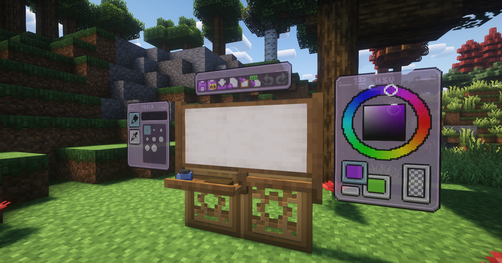
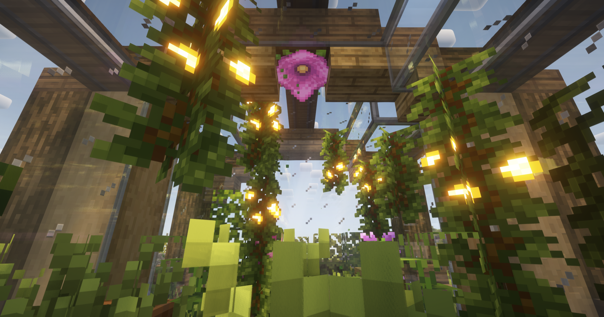
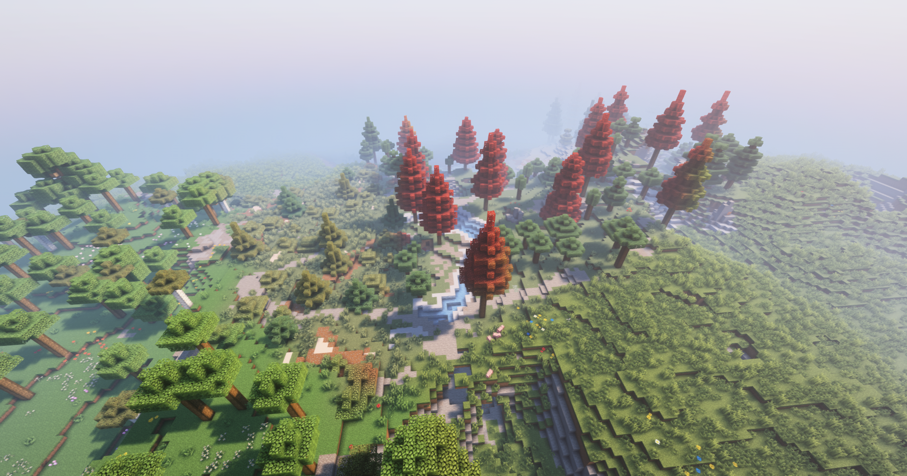

import { FileTree } from '@astrojs/starlight/components';
import { LinkButton } from '@astrojs/starlight/components';
import { Tabs, TabItem } from '@astrojs/starlight/components';
import { Steps } from '@astrojs/starlight/components';
import { Badge } from '@astrojs/starlight/components';
import { Aside } from '@astrojs/starlight/components';
import { LinkCard } from '@astrojs/starlight/components';
import { Card } from '@astrojs/starlight/components';

<Card title="Plasmo voice chat">

- Что это?
  > Это персональный voice-чат, позволяющий говорить голосом в самой игре (ну или сервере)
- Как настроить?
  > Нажав клавишу `V`, там легкая и гибкая настройка.

- Команды
  > `/groups` - настройки групп

</Card>

<Card title="Рисование">

> Для начала рисования на новой картине, вам нужно как раз скрафтить картину, а уже потом кинуть на неё куриное яйцо. После чего вы сможете рисовать на новом холсте!
</Card>

<Card title="EmoteCraft">
- Что это?
  > Много функциональный мод, для отображения ваших эмоций прямо в игре!
- Как использовать?
  > Советую изучить [официальную википедию по моду](https://kosmx.gitbook.io/emotecraft), но в базе нажимая кнопку `B` вы открываете меню мода.
</Card>

<Card title="Генерация мира">
> Тут нечего говорить, просто советую посмотреть:

</Card>

<Card title="Расы">
> А ознакомиться с ними можно [тут](/main/mechanics/races)
</Card>